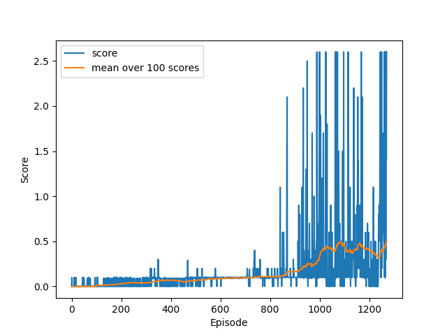

# Udacity - Deep Reinforcement Learning - Project 3

## Project Description

In this exercise the task is to create and train two agents to play tennis with each other.
The aim is to train the agents in such a way that the pass the ball to each other.
When an agent drops the ball it receives a negative reward of -0.01.
If an agent can pass the ball over the net the agent receives a positive reward of +0.1.
Therefore, the rewards are better the longer the agents play and pass the ball over the net to each other.

The environment vectors have the following dimensions for each agent:
- State vector size: 3 * 8 = 24 (3 frames of 8 observations stacked)
- Action vector size: 2

Therefore, the global view of the environment has a state vector of size 48 and an action vector of size 4.

After each episode the scores of each agent are summed up and the maximum of these two values is taken as episode score.
In order to solve the environment the score as described above over 100 episodes has the to be higher than 0.5 in average.

For this exercise it is a requirement that the agents utilize the [MADDPG](MADDPG_paper) architecture which is the multiagent version of [DDPG](DDPG_paper).

[DDPG_paper]: https://arxiv.org/pdf/1509.02971v6.pdf
[MADDPG_paper]: https://arxiv.org/pdf/1706.02275v4.pdf

## Solution Description

The environment is solved with the code and the agent in this repository.
The solution is build in various python files.
How to install the program and the dependencies is described in the `README.md` file in the section *Dependencies* and how operate the program is described in the `README.md` file in the section *Execution*.

The solution meets the requirement that the DDPG and the MADDPG architecture build the foundation of the agents.

### General Architecture

The general architecture of this project is according to requirements based on DDPG and MADDPG.
This approach requires an actor and an target_actor as well as a critic and a target_critic.
The networks which are not target networks (local network in the following) are utilized for training.
After each training step the new local network parameters are partially transferred to the target networks.
This ensures stability during the learning process.

#### Neuronal Network

The neuronal network is a group of layers of neurons and connections between the neurons of one layer to the neurons of the next layer.
The input layer is the entry point of information and the output layer is the exit point of the network where a decision is made.
Information that is passed into the network activates the neurons in the input layer which again activates the next layer and so on until the output layer is activated and a decision was made.
The intensity of the activation depends on the weights stored in the connection of the neurons.
During the training of the agent these weights are adopted to achieve the desired activation in the output layer corresponding to the input at the input layer.

### Specific Architecture

The solution for this exercise utilized the DDPG and MADDPG architecture.
Therefore, the MADDPG agent contains multiple DDPG agents.
The critic (and the target critic) of the DDPG agents has a global view.
That means that the critic is provided the state vector and the actions of all agents.
The actor (and the target actor) of the DDPG agents has a local view.
That mean that the actor is provided the state vector of the single agent.

The implementation details of the agent, the agent_group and the networks they utilize can be found in the following files:
- `src/networks/actor.py`: the actor and target actor network
- `src/networks/critic.py`: the critic and target critic network
- `src/networks/network.py`: an abstract base class for the actor and the critic
- `src/agent.py`: a DDPG agent (only those parts that are required for MADDPG)
- `src/agent_group.py`: a MADDPG agent built from DDPG agents

The basic papers of MADDPG and DDPG recommend a replay buffer that takes random samples.
This has not been showing good results for this environment, therefore this solution applies a simple approach on a weighting.
Each step of the simulation is added to the replay buffer, where the reward of that steps is also stored additionally.
The weighting is based on the normalized (min-max normalization) rewards.
To prevent a weight of zero a small offset is added to each weight.
This modification to the MADDPG and DDPG algorithm improved stability significantly.

The implementation details of the buffer and the weighting can be found in the following files:
- `src/buffer.py`

In the file `collaborative-competition.py` is the entry point for the execution of this project.

The hyperparameters which are described in more detail in the section below can be found in the files:
- `hyperparameters.py`: hyperparameters utilized for the `training` mode
- `hyperparameters_range.py`: hyperparameters utilized for the `tune` mode

The hyperparameters as show in `hyperparameters.py` have been applied to solve the environment in less than 1300 steps.
The graphic below shows the score (blue) as well as the mean score over 100 episodes (orange) of the according run.

#### Findings

While solving this exercise various configurations for the hyperparameters have been tried.

With the following hyperparameters the environment was solved with less than 1300 episodes.

- `episodes`: maximum number of episodes
- `steps`: maximum number of steps for each episode
- `discount`: discount factor for future rewards (gamma)
- `buffer_size`: maximum size of the replay buffer
- `learning_frequency`: number of episodes after which the learning process is triggered
- `batch_size`: size of a batch that the agents will learn
- `buffer_iterations`: number of iterations of taking a sample from the buffer
- `sample_iterations`: number of iterations of learning a sample

- `noise_maximum`: maximum noise scaling factor (noise scaling factor at the start)
- `noise_minimum`: minimum noise scaling factor (noise scaling factor at the end)
- `noise_decay`: factor of noise reduction after each step

- `tau`: factor for soft update of DDPG learning process

- `actor_layers`: network architecture for the actor network
- `actor_activation_function`: activation function applied after each layer of the neuronal network of the actor (except the last)
- `actor_output_function`: activation function after the last layer of the neuronal network of the actor, if set to `None` no such function is applied
- `actor_optimizer`: optimizer function of the actor
- `actor_optimizer_learning_rate`: optimizer learning rate of the actor
- `actor_covariance`: size of the covariance of the actor action selection

- `critic_layers`: network architecture for the critic network
- `critic_activation_function`: activation function applied after each layer of the neuronal network of the critic (except the last)
- `critic_output_function`: activation function after the last layer of the neuronal network of the critic, if set to `None` no such function is applied
- `critic_optimizer`: optimizer function of the critic
- `critic_optimizer_learning_rate`: optimizer learning rate of the critic

### Improvements

The code provided in this repository solves the given environment.
Of course there is plenty of room for improvements:

- Setting manual seeds on every step that is based on random decisions would help easy the development process of any other further improvement.
- Instead of learning a step on an episode of the simulation it might be better to learn an episode of the simulation.
- The architecture provided in this repository has a weighted buffer.
  The weighting is based on the reward for single steps.
  Other weighting techniques might lead to better results.
- Further hyperparameter tuning might be beneficial.
  The unstable properties of multiple agents made the process of hyperparameter tuning difficult and time-consuming.
  Hyperparameter tuning with multiple runs on the same set of hyperparameters and averaging over the results might lead to a more stable set of hyperparameters and better performance.
- Performance improvements can be made.
  The code to solve the environment was not written with performance in mind.
  The focus was on solving the problem with easy to understand code.
  Therefore, room for performance improvements is definitely given.

Based on the high instability caused by multiple agents the number of episodes required to solve the environment has a high variety.

A beneficial 

## Summary

This exercise has been the most challenging exercise of the Udacity Deep Reinforcement Learning Nano Degree.
The high instability caused by multiple agents interacting makes the development process much more difficult.
Additionally, the high impact of noise (for example in the initial weight or on the drawing process when samples are taken from the buffer) makes it hard to determine the quality of the solution approach.

Nevertheless, I have been able to learn a lot during this course especially in the three main exercises.